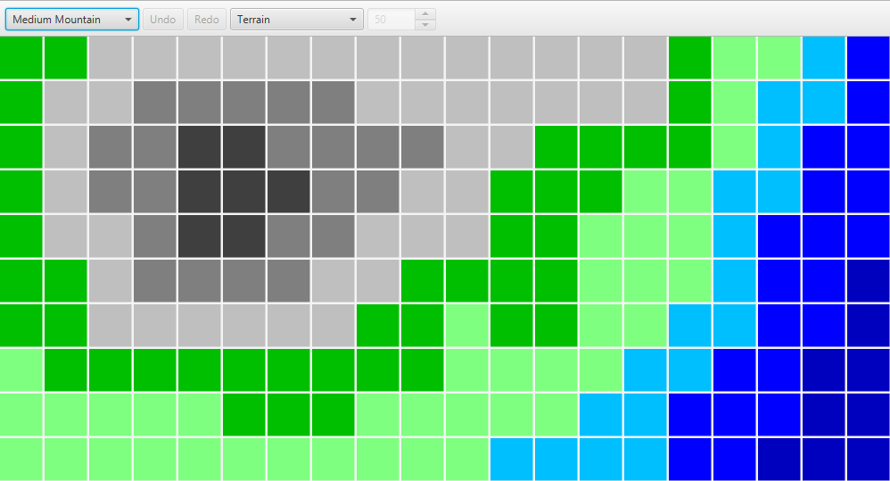

# Documentation

## Hierarchy of Maps

### World

**Land Distribution Map:**
A map that helps with the generation of continents & oceans during world generation. 

**World Map:**
An abstract representation of the whole world.

### Region

**Sketch Map:**
An abstract representation of a region.
Individual objects like a building or a tree are abstracted away as Forests or Settlements,
unless they are important enough.

**Region Map:**
An more detailed representation of a region.
Individual objects like a building or a tree are represented by individual but abstract objects. 

| Feature | Sketch | Region |
|---|:---:|:---:|
| Cell Size | 100 m | 1 m |
| Terrain | Terrain Type | ? |
| Roads | Graph | Mesh |
| Rails | Graph | Mesh |
| Rivers | Graph | Mesh |
| Forests | Footprint | Plants |
| Fields | Footprint | ? |
| Settlements | Footprint | Buildings & Roads |

### Local

**Local Map:**
An full representation of a region without any abstract objects.
